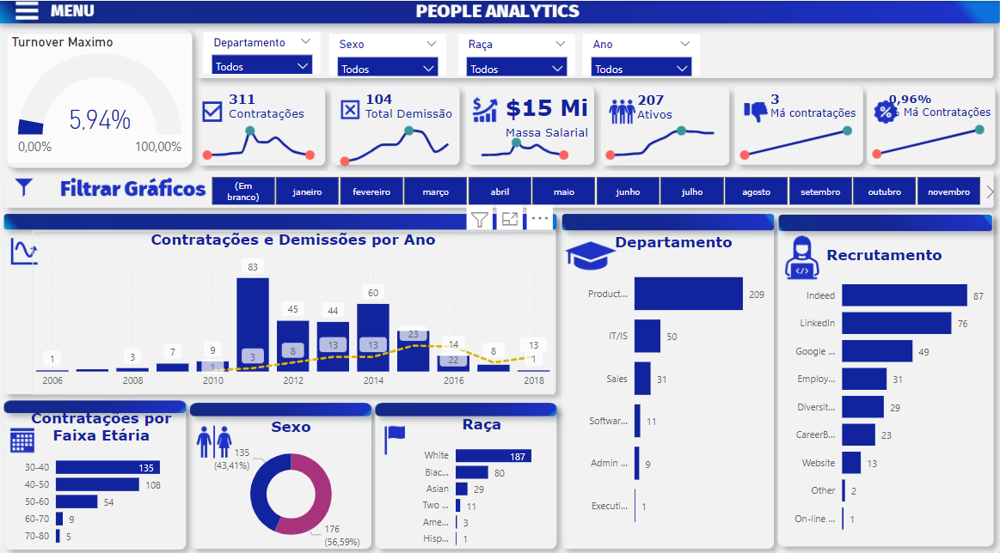

# Projeto: Recursos Humanos

## Introdução do problema
Fazer a gestão de pessoas é necessária para manter uma empresa funcionando. Conhecer a massa salarial dos funcionários, as contratações e demissões, o número de má contratações e o turnover (rotatividade da empresa) são algumas métricas necessárias para uma boa gestão da empresa tornando-a muito mais produtiva.

**Objetivo:** Fazer uma análise do setor de recursos humanos de uma empresa e verificar as contratações mais assertivas, maior produtividade, redução de custos, a retenção de talentos, o engajamento e bem-estar dos colaboradores.

**Dataset:** É um conjunto de dados de recursos humanos uma empresa fictícia. Dados foram extraídos do kaggle (https://www.kaggle.com/datasets/rhuebner/human-resources-data-set).

## Desenvolvimento

**Ferramenta:** Power BI na criação do dashboard e o tratamento dos dados (ETL) no Power Query Editor, e análise e cálculos de dados usando fórmulas DAX.

**Resultados:** Para este problema de people analytics foram analisadas as seguintes variáveis: número de contratações, demissões, funcionários ativos, massa salarial, má contratações, o turnover máximo, as contratações e demissões por ano, departamento, faixa etária, sexo, raça e fonte de contratação.

Na análise de funcionários pode-se ver que a empresa possui 207 funcionários ativos, com uma massa salarial de 15 milhões. A faixa etária de maior contratação é entre 30 a 40 anos. 56,59% dos funcionários são mulheres e maioritariamente 187 são da raça branca. O turnover máximo é de 5,94%. O departamento que mais contrata é o de Produção e é o setor que mais tem demissões. A área com o maior turnover é a área de Produção com 4,57%. O departamento Administrativo é o setor que tem a maior porcentagem de má contratações, 11,11%. A maioria dos funcionários foram recrutados pelo site Indeed, seguido do LinkedIn. Na análise financeira dos funcionários percebe-se que a maior massa salarial encontra-se no departamento de Produção, mas considerando por funcionário a maior massa salarial está no setor Administrativo e no de Engenharia de Software.

## Conclusão

A partir dessa análise os resultados mostram que a empresa está tendendo a uma porcentagem alta de rotatividade. Com isso várias causas podem ser analisadas como ambiente negativo, liderança ruim, salários não compatíveis com a função e falta de reconhecimento. Foi possível identificar que o departamento com maior turnover é o de Produção, com isso pode-se verificar neste setor as condições de trabalho, o plano de carreira, os feedbacks e buscar implementar estratégias que auxiliem na retenção dos funcionários.

**Para acessar e navegar pelo dashboard no Power BI**, clique [aqui](https://app.powerbi.com/reportEmbed?reportId=f561cbe4-4e5f-4580-8ca7-dba386d4d954&autoAuth=true&ctid=659ce2b8-0714-4198-8c38-dc9b60aabb57)

Projeto desenvolvido no curso "Data Insights" do Programa Dominando Data Science 3.0 oferecido pela FLAI - Inteligência Artificial e Data Science. 
